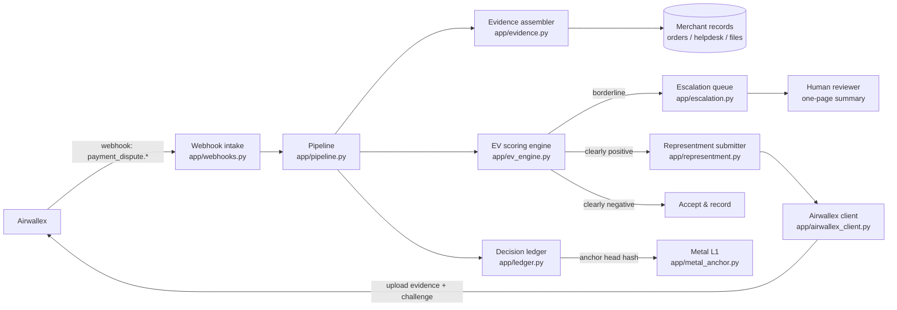

# Verity — Autonomous Dispute Response Agent

**An AI agent that answers payment disputes before their deadlines — and can prove every decision it made.**

Built for the **Airwallex Agentic Banking Hackathon** (Track 4) by Quincy's Team.

---

## The problem

When a customer disputes a card payment, the money is pulled from the merchant immediately. The merchant can win it back only by responding — with the right evidence, in the right format — before a hard deadline ("representment"). Miss the deadline or send weak evidence and the loss is final.

Large merchants have chargeback teams and tooling for this. Small merchants don't. They find out about disputes late, can't assemble receipts / delivery proof / customer messages in time, and lose money they were legitimately owed — or waste hours fighting disputes that were never winnable.

## What Verity does

Verity is an autonomous agent that runs the whole dispute workflow the moment a dispute lands:

1. **Intake** — receives Airwallex dispute events via webhooks (`payment_dispute.requires_response`) and starts the clock against the dispute's response deadline.
2. **Evidence assembly** — automatically gathers the evidence package from the merchant's records: receipt/invoice, delivery proof (tracking + proof of delivery), customer communications, and terms-acceptance logs — weighted toward what matters for that dispute's reason code.
3. **Expected-value scoring** — scores every dispute with explicit math: `EV(challenge) = win_probability × amount − response_cost`. Win probability blends a per-reason base rate with the assembled evidence's completeness. No vibes — the number is in the audit log.
4. **Representment** — for clearly positive-EV disputes, uploads the evidence files and submits the challenge through Airwallex's dispute API before the deadline.
5. **Human escalation** — borderline cases (EV inside an uncertainty band) are escalated to a human with a one-page summary: dispute facts, the EV math, evidence present *and* missing, and the deadline.
6. **Immutable audit trail** — every decision, its score, and a hash of its evidence manifest are appended to a SHA-256 hash-chained ledger. The chain head is anchored to **Metal L1**, so the record of *why* an agent moved money can be verified by anyone — the merchant, Airwallex, or an auditor — without trusting Verity's database.

Verity also respects Airwallex's own automation (documented auto-defence of fully refunded disputes, auto-acceptance of small pre-chargebacks) and never double-responds to a dispute Airwallex already handled.

## Architecture



## Airwallex API surface

Everything below is taken from Airwallex's public documentation ("Handle disputes using our APIs", dispute flow, and webhook references at airwallex.com/docs) — verified October 2026:

| Capability | What Verity uses |
|---|---|
| Dispute webhooks | `payment_dispute.requires_response` triggers the workflow; `challenged` / `accepted` / `reversed` / `won` / `lost` / `expired` / `pending_closure` events track outcomes |
| Retrieve a dispute | `GET /api/v1/pa/payment_disputes/{dispute_id}` |
| List disputes | `GET /api/v1/pa/payment_disputes?stage=&status=&reason_code=&due_date=&updated_at=` |
| Upload evidence | `POST /api/v1/files/upload/{file_path}` → returns a `file_id` referenced by the challenge |
| Challenge (representment) | `POST /api/v1/pa/payment_disputes/{dispute_id}/challenge` |
| Sandbox | `https://api.sandbox.airwallex.com` — the client's default base URL |

Marked as **planned / to verify in the build window** (deliberately not asserted here): the exact accept-dispute endpoint path, webhook signature header details, and the API-key → bearer-token exchange. The client in `app/airwallex_client.py` labels these as TODOs and, in dry-run mode, records the requests it *would* send instead of fabricating responses.

## Decision integrity (Metal L1)

Each ledger entry's hash covers the previous entry's hash plus the canonical JSON of the entry: sequence, timestamp, dispute id, decision, the full EV score, and the SHA-256 manifest hash of the evidence package. Anchoring the head hash to Metal L1 commits to the entire history — rewrite any past decision and the head no longer matches the anchored value. Verification is a pure function (`DecisionLedger.verify()`), covered by tamper and deletion tests.

## Repo layout

```
app/
  main.py               FastAPI entrypoint (/health, /webhooks/airwallex, /ledger, /escalations)
  webhooks.py           Webhook intake (signature verification: TODO, marked)
  pipeline.py           Orchestrates intake -> evidence -> score -> action -> ledger
  evidence.py           Evidence assembler + merchant-records protocol (+ demo provider)
  ev_engine.py          EV scoring engine — working math, unit-tested
  representment.py      Representment submitter (dry-run honest)
  escalation.py         Human escalation queue + one-page summaries
  ledger.py             Hash-chained decision ledger — working, unit-tested
  metal_anchor.py       Metal L1 anchoring (stub with the full design)
  airwallex_client.py   Airwallex API client (verified paths, auth TODO)
  models.py             Dispute / evidence models mirroring Airwallex payloads
  config.py             Env-based settings (no credentials in the repo)
tests/                  pytest suite for the EV engine, ledger, and pipeline
docs/submission-checklist.md
```

## Status & honesty

This repository is the **pre-build skeleton** for the hackathon build window (Oct 25 – Nov 13, 2026):

* ✅ Working + tested: EV scoring engine, hash-chain ledger, evidence completeness model, escalation summaries, pipeline wiring, FastAPI app (18 tests passing).
* 🏷️ Clearly-labelled stubs: Airwallex live calls (auth TODO), webhook signature verification (TODO), Metal L1 anchor submission (TODO).
* 🚫 Never faked: dry-run mode records intended API calls and reports `submitted: false`. No real credentials, no invented API responses.

## Run it

```bash
python -m venv .venv && . .venv/bin/activate
pip install -r requirements.txt
pytest                       # 18 tests
uvicorn app.main:app --reload
# POST a dispute webhook shaped like the Airwallex docs sample to
# http://127.0.0.1:8000/webhooks/airwallex and watch the decision,
# then GET /ledger and /escalations.
```

## Roadmap — build window (Oct 25 – Nov 13)

1. Airwallex sandbox: API-key auth, live dispute retrieval, evidence upload, challenge submission end-to-end.
2. Webhook signature verification + idempotent event handling.
3. Real merchant records connectors (order system + helpdesk exports).
4. LLM-drafted, scheme-aware representment narratives (replacing the template).
5. Ledger persistence + scheduled Metal L1 anchoring; public verification page.
6. Deadline guardian: escalation SLAs as `due_at` approaches.
7. Demo video + final HackerEarth submission (see `docs/submission-checklist.md`).

## License

MIT — see [LICENSE](LICENSE).
