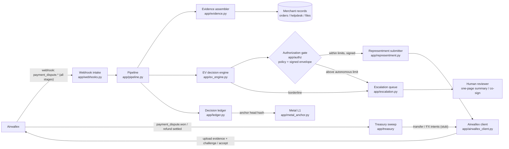

# Verity — Autonomous Dispute Response Agent

**Verity decides.** An autonomous agent that decides which payment disputes are worth fighting — then fights them, accepts them, or escalates them, with the math shown, every action signed, and every outcome audited.

Built for the **Airwallex Agentic Banking Hackathon** (Track 4 — Dispute Response Agent) by Quincy's Team.

---

## The problem

When a customer disputes a card payment, the money is pulled from the merchant immediately. The merchant can win it back only by responding — with the right evidence, in the right format — before a hard deadline ("representment"). Miss the deadline or send weak evidence and the loss is final.

Large merchants have chargeback teams for this. Small merchants don't. They find out about disputes late, can't assemble receipts / delivery proof / customer messages in time, and lose money they were legitimately owed — or burn hours fighting disputes that were never winnable.

## The gap Verity fills: deciding, not defending

Evidence assembly is becoming a commodity — Airwallex itself sells AI dispute automation that gathers evidence and estimates win probability (see the comparison section below). What nobody hands the merchant is the **decision layer**:

* an explicit, auditable **economic decision** — challenge, accept, or escalate — computed from expected value, not a suggestion;
* **autonomous execution** of that decision across the *entire* dispute lifecycle, on the standard APIs any merchant can use;
* **bounded, signed authority** — the agent acts on money only inside policy limits, under a verifiable identity, with a human co-sign above them;
* and a **tamper-evident record** of every decision, so the agent's judgment can be audited after the fact.

That layer is Verity.

## What Verity does

1. **Intake across the full lifecycle** — receives Airwallex dispute events via webhooks (`payment_dispute.*`) at every stage — RFI, pre-chargeback, chargeback, pre-arbitration, arbitration — and starts the clock against each response deadline.
2. **Evidence assembly** — gathers the evidence package from the merchant's records: receipt/invoice, delivery proof, customer communications, terms-acceptance logs — weighted toward what matters for that dispute's reason code. (Supporting actor, deliberately: it's table stakes now.)
3. **The decision** — scores every dispute with explicit expected-value math: `EV(challenge) = win_probability × amount − response_cost`. Win probability blends a per-reason base rate with evidence completeness. The number, its inputs, and the rationale are written to the audit log. Clearly positive EV → challenge. Clearly negative → **accept on purpose** (fighting would burn more than it returns — including executing the refund leg). In between → a human decides.
4. **Authorization** — before any money-moving action executes, it passes a policy gate and is sealed in a **signed action envelope** (Visa TAP-style agent identity; see below). Actions above the autonomous limit are rerouted to a human co-sign instead of executing.
5. **Execution** — uploads the evidence files and submits the challenge through Airwallex's dispute API before the deadline; records accepts; escalates borderline cases with a one-page summary (facts, EV math, evidence present *and* missing, deadline).
6. **Recovery** — when a dispute is won (or a refund-on-accept settles), the treasury sweep moves recovered funds out of the settlement balance per policy: keep the operating minimum, sweep the rest, convert foreign currency only at a policy-acceptable rate.
7. **Immutable audit trail** — every decision, its score, its signed envelope, and a hash of its evidence manifest are appended to a SHA-256 hash-chained ledger. The chain head is anchored to **Metal L1**, so the record of *why* an agent moved money can be verified by anyone — the merchant, Airwallex, or an auditor — without trusting Verity's database.

Verity also respects Airwallex's own automation (documented auto-defence of fully refunded disputes, auto-acceptance of small pre-chargebacks) and never double-responds to a dispute Airwallex already handled.

## How Verity differs from Airwallex AI Dispute Automation

Airwallex already sells an AI dispute product. Verity is not a reskin of it — the deltas below are the product. Each is labelled with its real status in this repo, per the honesty standard used throughout.

| # | Delta | Verity | Airwallex AI Dispute Automation | Status in this repo |
|---|---|---|---|---|
| 1 | **Decides *and* executes — including deliberately not fighting** | Every dispute gets an explicit EV decision (`p × amount − response cost`): challenge, accept, or escalate. Accepting is a first-class, executed outcome — when fighting is negative-EV, Verity concedes and handles the refund leg instead of burning money on defence. | Built to defend: it assembles evidence, generates defence reports, and attaches AI metrics (win probability, *suggested* action). The decision — and the discipline to walk away — stays with the merchant. | **Implemented** — EV engine + decision bands + executed dry-run flow. Live accept-endpoint call: **Stub** (path unverified in public docs, marked TODO). |
| 2 | **Full-lifecycle coverage** | One agent across all five stages — RFI → pre-chargeback → chargeback → pre-arbitration → arbitration — with the decision re-evaluated as a case escalates through stages. | Centred on the chargeback response step. | **Implemented** in the stage model + stage-agnostic pipeline; per-stage playbooks: **Design**. |
| 3 | **Runs on the standard public APIs** | Built entirely on the documented dispute APIs any merchant can call (webhooks, retrieve/list, file upload, challenge). No special access. | The AI Client API variant is gated — available to selected merchants and industries, onboarded via an Airwallex rep. | **Implemented** — the client uses only verified public endpoints; live auth: **Stub** (TODO). |
| 4 | **Policy-gated, signed actions (Visa TAP-style)** | No action executes unsigned. Each passes a policy gate (per-action autonomous limits; above the limit a human co-signs) and is sealed in a signed envelope bound to the audit-ledger head — stale or tampered envelopes are refused before the API is touched. | No equivalent published: actions are taken inside the merchant's own Airwallex account tooling, without an agent-authorization layer. | Policy gate + envelope + execution enforcement: **Implemented** and tested. Real Visa TAP identity/signature integration: **Stub** (needs Visa partner docs + keys). |
| 5 | **Recovered money is put to work** | Won/refunded funds are swept by policy (operating minimum kept; FX conversion only at an acceptable rate) instead of idling in the settlement balance. | Ends at the dispute outcome. | Sweep policy engine: **Implemented** and tested. Airwallex transfer/FX calls: **Stub** (dry-run intents). |
| 6 | **Every decision is independently auditable** | Decisions, EV inputs, envelopes, and evidence-manifest hashes are hash-chained and anchored to Metal L1 — a third party can verify the record without trusting Verity's database. | Reporting lives inside Airwallex's dashboard. | Ledger: **Implemented** and tested (tamper/deletion detection). Metal L1 anchor submission: **Stub**. |

## Architecture



## Authorization layer (Visa TAP-style)

Visa's Trusted Access Protocol (TAP) gives AI agents a verifiable identity and scoped authority to act on a principal's behalf. Verity applies that pattern to dispute actions — this is the Visa Award angle, and it is deliberately honest about its stage:

* **Implemented and tested** (`app/authz/`): the policy gate (per-action autonomous limits — challenge ≤ 1,000, accept/refund ≤ 500, sweep/FX ≤ 5,000 by default; above → human co-sign), canonical signed envelopes carrying the action payload hash and the ledger head they were authorized against, and execution-time verification in the submitter — unsigned, tampered, or stale envelopes are refused *before* the Airwallex client is touched. Every issued envelope is stored in the ledger entry for its decision.
* **Stub / TODO**: the actual TAP integration — registering Verity's agent identity with Visa, Visa's signature scheme, and partner keys — requires Visa's partner documentation and credentials. The envelope's signature field is produced by a clearly-labelled placeholder signer (see `app/authz/envelope.py`) standing in for the TAP signature; it is not a credential and is never presented as a Visa-issued signature.

## Airwallex API surface

Taken from Airwallex's public documentation ("Handle disputes using our APIs", dispute flow, and webhook references at airwallex.com/docs) — verified October 2026:

| Capability | What Verity uses |
|---|---|
| Dispute webhooks | `payment_dispute.requires_response` triggers the workflow; `challenged` / `accepted` / `reversed` / `won` / `lost` / `expired` / `pending_closure` events track outcomes across all stages |
| Retrieve a dispute | `GET /api/v1/pa/payment_disputes/{dispute_id}` |
| List disputes | `GET /api/v1/pa/payment_disputes?stage=&status=&reason_code=&due_date=&updated_at=` |
| Upload evidence | `POST /api/v1/files/upload/{file_path}` → returns a `file_id` referenced by the challenge |
| Challenge (representment) | `POST /api/v1/pa/payment_disputes/{dispute_id}/challenge` |
| Balances / FX / Transfers | Documented surfaces the treasury sweep targets (balances, quotes/conversions, transfers with idempotency keys) — wiring is a build-window TODO; the sweep executor records intents in dry-run and asserts no endpoint paths |
| Sandbox | `https://api.sandbox.airwallex.com` — the client's default base URL; sandbox dispute simulation is purpose-built (dedicated simulation APIs + deterministic test cards), so the full loop is demoable deterministically |

Marked as **planned / to verify in the build window** (deliberately not asserted here): the exact accept-dispute endpoint path, webhook signature header details, and the API-key → bearer-token exchange. The client in `app/airwallex_client.py` labels these as TODOs and, in dry-run mode, records the requests it *would* send instead of fabricating responses.

## Decision integrity (Metal L1)

Each ledger entry's hash covers the previous entry's hash plus the canonical JSON of the entry: sequence, timestamp, dispute id, decision, the full EV score, the signed authorization envelope (when one was issued), and the SHA-256 manifest hash of the evidence package. Anchoring the head hash to Metal L1 commits to the entire history — rewrite any past decision and the head no longer matches the anchored value. Verification is a pure function (`DecisionLedger.verify()`), covered by tamper and deletion tests.

## Repo layout

```
app/
  main.py               FastAPI entrypoint (/health, /webhooks/airwallex, /ledger, /escalations)
  webhooks.py           Webhook intake (signature verification: TODO, marked)
  pipeline.py           Orchestrates intake -> evidence -> decision -> authorize -> action -> ledger; recovery -> sweep
  evidence.py           Evidence assembler + merchant-records protocol (+ demo provider)
  ev_engine.py          EV decision engine — working math, unit-tested
  triage.py             Triage entry point: plain EV function + delegation to the engine
  authz/                TAP-style authorization: policy gate, signed envelopes, gateway (working, tested)
  representment.py      Representment submitter (dry-run honest; refuses unsigned execution via authz wrapper)
  escalation.py         Human escalation queue + one-page summaries
  treasury/             Recovery sweep: policy engine (working, tested) + executor (dry-run stub)
  ledger.py             Hash-chained decision ledger — working, unit-tested
  metal_anchor.py       Metal L1 anchoring (stub with the full design)
  airwallex_client.py   Airwallex API client (verified paths, auth TODO)
  models.py             Dispute / evidence models mirroring Airwallex payloads (all five dispute stages)
  config.py             Env-based settings (no credentials in the repo)
tests/                  pytest suite: EV engine, triage, ledger, pipeline, authz, treasury
docs/architecture.md    Components, data flow, and the EV decision formula in full
docs/submission-checklist.md
```

## Status & honesty

This repository is the **pre-build skeleton** for the hackathon build window (Oct 25 – Nov 13, 2026):

* ✅ Working + tested: EV decision engine, authorization policy gate + signed envelopes + execution enforcement, treasury sweep policy engine, hash-chain ledger, evidence completeness model, escalation summaries, pipeline wiring, FastAPI app (**42 tests passing**).
* 🏷️ Clearly-labelled stubs: Airwallex live calls (auth TODO), webhook signature verification (TODO), real Visa TAP signature/identity (partner docs + keys TODO), Airwallex transfer/FX execution (dry-run intents), Metal L1 anchor submission (TODO).
* 🚫 Never faked: dry-run mode records intended API calls and reports `submitted: false` / `executed: false`. No real credentials, no invented API responses, no placeholder signature presented as a real one.

## Run it

```bash
python -m venv .venv && . .venv/bin/activate
pip install -r requirements.txt
pytest                       # 42 tests
uvicorn app.main:app --reload
# POST a dispute webhook shaped like the Airwallex docs sample to
# http://127.0.0.1:8000/webhooks/airwallex and watch the decision,
# its signed authorization envelope, then GET /ledger and /escalations.
```

## Roadmap — build window (Oct 25 – Nov 13)

1. Airwallex sandbox: API-key auth, live dispute retrieval, evidence upload, challenge submission end-to-end; dress rehearsal on the sandbox's deterministic dispute-simulation cards.
2. Webhook signature verification + idempotent event handling.
3. Visa TAP: agent identity registration + real signature integration (partner docs/keys), replacing the placeholder signer.
4. Treasury: live balance reads, transfer + FX conversion wiring for the sweep.
5. Real merchant records connectors (order system + helpdesk exports).
6. LLM-drafted, scheme-aware representment narratives (replacing the template).
7. Ledger persistence + scheduled Metal L1 anchoring; public verification page.
8. Deadline guardian: escalation SLAs as `due_at` approaches.
9. Demo video + final HackerEarth submission (see `docs/submission-checklist.md`).

## License

MIT — see [LICENSE](LICENSE).
